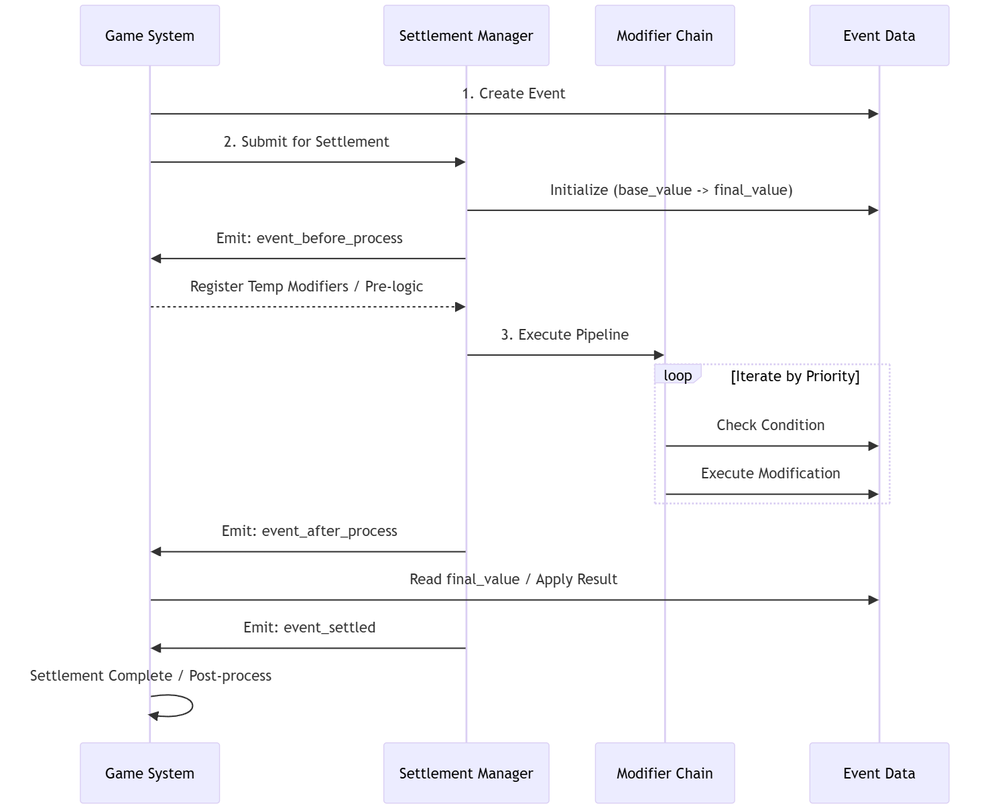
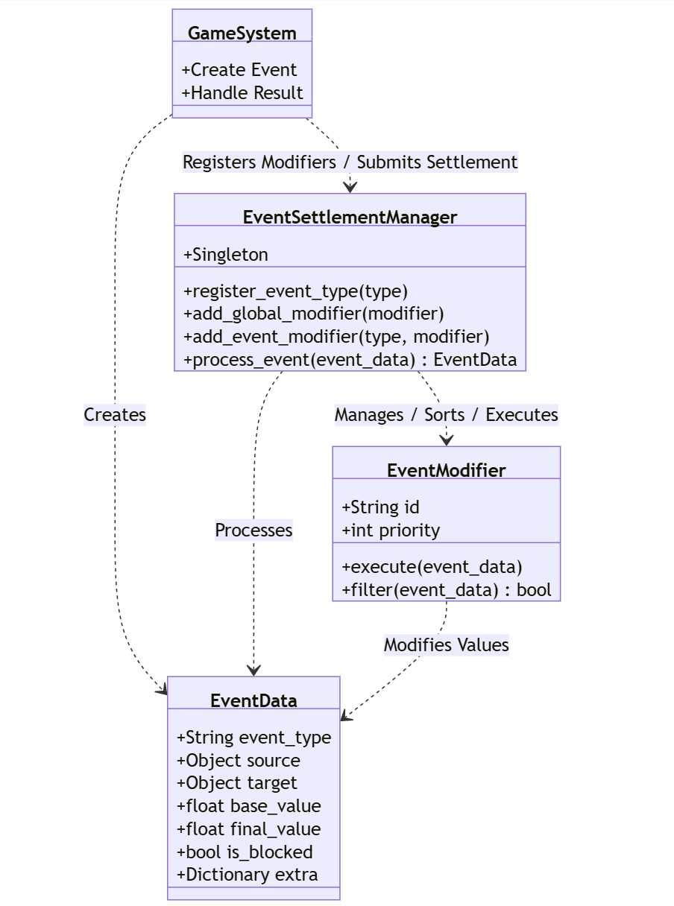

# Event Settlement System

General-purpose numeric settlement pipeline for Godot 4.6+

> 中文文档请参见 [README.md](README.md)

---

## Overview

The Event Settlement System is an event-driven numeric pipeline designed for scenarios that involve large volumes of value modifications. It abstracts the typical turn-based process "card played → buff resolution → enemy passives → result" and can be used by card games, RPG combat, and strategy titles that need deterministic, debuggable value processing.

### Why another settlement system?

Traditional combat scripts quickly become hard to maintain:

```gdscript
func calculate_damage(attacker, defender, base_damage):
    var damage = base_damage
    damage += attacker.attack_bonus
    damage *= attacker.damage_multiplier
    if randf() < attacker.crit_chance:
        damage *= 2.0
    if defender.has_status("shield"):
        damage = min(damage, defender.shield_cap)
    return max(damage - defender.armor, 0)
```

The plugin encourages splitting that logic into events plus modifiers:

```gdscript
var damage_event = EventUtils.create_damage_event(attacker, defender, base_damage)
var result = EventSettlementManager.process_event(damage_event)
```

Each buff, shield, or passive becomes a self-contained modifier that is easy to add or remove.

---

## Features

### Core capabilities

1. **Modifier system** – additive, multiplicative, override, and custom modes with chainable configuration.
2. **Priority control** – deterministic execution order so that "player buff → skill effect → enemy passive" remains consistent.
3. **Multi-stage processing** – before, during, after, and settlement hooks where additional logic or signals can be inserted.
4. **History tracing** – detailed value change tracking in debug builds.

### Advanced features

- **Settlement pipelines** for multi-step abilities.
- **Condition helpers** to quickly filter when modifiers apply.
- **Block/interrupt mechanism** via `event_data.is_blocked` for dodge/immunity.
- **WeakRef usage** to avoid dangling references.
- **`unique_id` management** for replacing or unregistering buffs.

---

## Visual Overview





---

## Quick Start

### Installation

1. Download the plugin from the Asset Library or clone this repository to `addons/event_settlement_system`.
2. Enable it through `Project → Project Settings → Plugins`.
3. Verify the singleton is loaded:

```gdscript
func _ready():
    print(EventSettlementManager)
```

### Five-minute tutorial

```gdscript
extends Node

func _ready():
    EventSettlementManager.register_event_type("damage")

    var crit = EventModifier.create_multiply_modifier("Crit", 2.0)
    crit.set_condition(EventUtils.condition_random_chance(0.2))
    EventSettlementManager.add_event_modifier("damage", crit)

    var damage_event = EventData.new("damage", self, self, 100.0)
    var result = EventSettlementManager.process_event(damage_event)

    print("Damage:", result.final_value)
    print(result.get_value_changes())
```

---

## Documentation

- Full user guide: [docs/UserGuide.en.md](docs/UserGuide.en.md)
- API reference: [docs/APIReference.en.md](docs/APIReference.en.md)
- Quick start cheat sheet: [QUICKSTART.en.md](QUICKSTART.en.md)
- Example scenes: [examples/](examples/)

---

## Key Concepts

### EventData

```gdscript
var event = EventData.new("damage", attacker, defender, 100.0)
event.set_extra("damage_type", "fire")
```

### EventModifier

```gdscript
var add_mod = EventModifier.create_add_modifier("Damage Bonus", 50.0, 100)
var mult_mod = EventModifier.create_multiply_modifier("Damage Boost", 1.5, 50)
var custom_mod = EventModifier.create_custom_modifier("Complex Logic", func(event):
    event.final_value = calculate_complex_damage(event),
    200
)
```

### EventSettlementManager

```gdscript
EventSettlementManager.add_global_modifier(modifier)
EventSettlementManager.add_event_modifier("damage", modifier)
var result = EventSettlementManager.process_event(event)
```

---

## Examples

### Card-style damage flow

```gdscript
class_name DamageSystem extends Node

func _ready():
    setup_damage_system()

func setup_damage_system():
    EventSettlementManager.register_event_type("damage")

    var armor_mod = EventModifier.create_custom_modifier("Armor", func(event):
        var armor = event.target.armor
        var reduction = armor / (armor + 100.0)
        event.final_value *= (1.0 - reduction),
        1000
    )
    EventSettlementManager.add_event_modifier("damage", armor_mod)

    var crit_mod = EventModifier.create_multiply_modifier("Crit", 2.0, 500)
    crit_mod.set_condition(func(event): return randf() < event.source.crit_rate)
    EventSettlementManager.add_event_modifier("damage", crit_mod)

    var element_mod = EventModifier.create_custom_modifier("Element", func(event):
        var dmg_type = event.get_extra("element", "normal")
        var def_type = event.target.element
        if (dmg_type == "fire" and def_type == "grass") or (dmg_type == "water" and def_type == "fire"):
            event.final_value *= 2.0,
        300
    )
    EventSettlementManager.add_event_modifier("damage", element_mod)
```

### Buff system

```gdscript
class_name BuffSystem extends Node

var active_buffs: Dictionary = {}

func apply_buff(target: Node, buff_id: String, multiplier: float, duration: float):
    var buff = EventModifier.create_multiply_modifier("Buff_%s" % buff_id, multiplier, 100)
    buff.set_condition(func(event): return event.target == target)
    EventSettlementManager.add_global_modifier(buff)
    active_buffs[buff_id] = buff

    await get_tree().create_timer(duration).timeout
    remove_buff(buff_id)

func remove_buff(buff_id: String):
    if active_buffs.has(buff_id):
        EventSettlementManager.remove_modifier(active_buffs[buff_id])
        active_buffs.erase(buff_id)
```

### Skill integration

```gdscript
class_name Skill extends Resource

@export var skill_name: String
@export var base_damage: float
@export var skill_type: String = "physical"

func cast(caster: Node, target: Node):
    var skill_event = EventData.new("skill_damage", caster, target, base_damage)
    skill_event.set_extra("skill_type", skill_type)
    skill_event.set_extra("skill_name", skill_name)

    if skill_type == "fire":
        var burn = EventModifier.create_custom_modifier("Burn", func(event):
            if randf() < 0.3:
                apply_burn_debuff(event.target),
            50
        )
        EventSettlementManager.add_event_modifier("skill_damage", burn)

    var result = EventSettlementManager.process_event(skill_event)
    apply_skill_effects(result)
    return result
```

---

## Project Structure

```
event_settlement_system/
├── addons/event_settlement_system/
│   ├── plugin.cfg
│   ├── plugin.gd
│   ├── core/
│   │   ├── event_settlement_manager.gd
│   │   ├── event_data.gd
│   │   ├── event_modifier.gd
│   │   └── settlement_pipeline.gd
│   └── utils/
│       └── event_utils.gd
├── docs/
│   ├── 使用文档.md (Chinese user guide)
│   ├── UserGuide.en.md (English user guide)
│   ├── API参考.md (Chinese API reference)
│   └── APIReference.en.md (English API reference)
└── examples/
    ├── example_usage.tscn
    └── example_usage.gd
```

---

## Use Cases

- Combat: damage, healing, crit, dodge
- Buff/debuff and status effect management
- Attribute/equipment scaling
- Multi-stage skill resolution
- Economy systems (currency, loot tables)
- Any event-driven numeric workflow

---

## Technical Highlights

- Pure GDScript with ~500 lines of core logic
- Debug mode enables assertions and full history tracking
- Snapshot iteration prevents list mutation issues during processing
- Compatible with desktop, mobile, and Web exports

---

## Requirements

- Godot Engine 4.6 or later

---

## Contributions

The project is not accepting external code contributions or pull requests right now. Please open Issues for bug reports or feature ideas.

---

## License

MIT License – see [LICENSE](LICENSE).

---

## Contact

- Author: <https://space.bilibili.com/162666214?spm_id_from=333.1007.0.0>

---

## Roadmap

### v1.0.0
- Core event system
- Modifier system
- Pipeline processing
- Samples and documentation

### v1.1.0
- Visualization/debug tooling
- Additional condition presets
- Real-world example project

### v2.0.0
- Network synchronization support
- Serialization/save support
- AI behavior tree integration (planned)
- Full combat template (planned)

---

**If this plugin helps you, please star the repo!**
