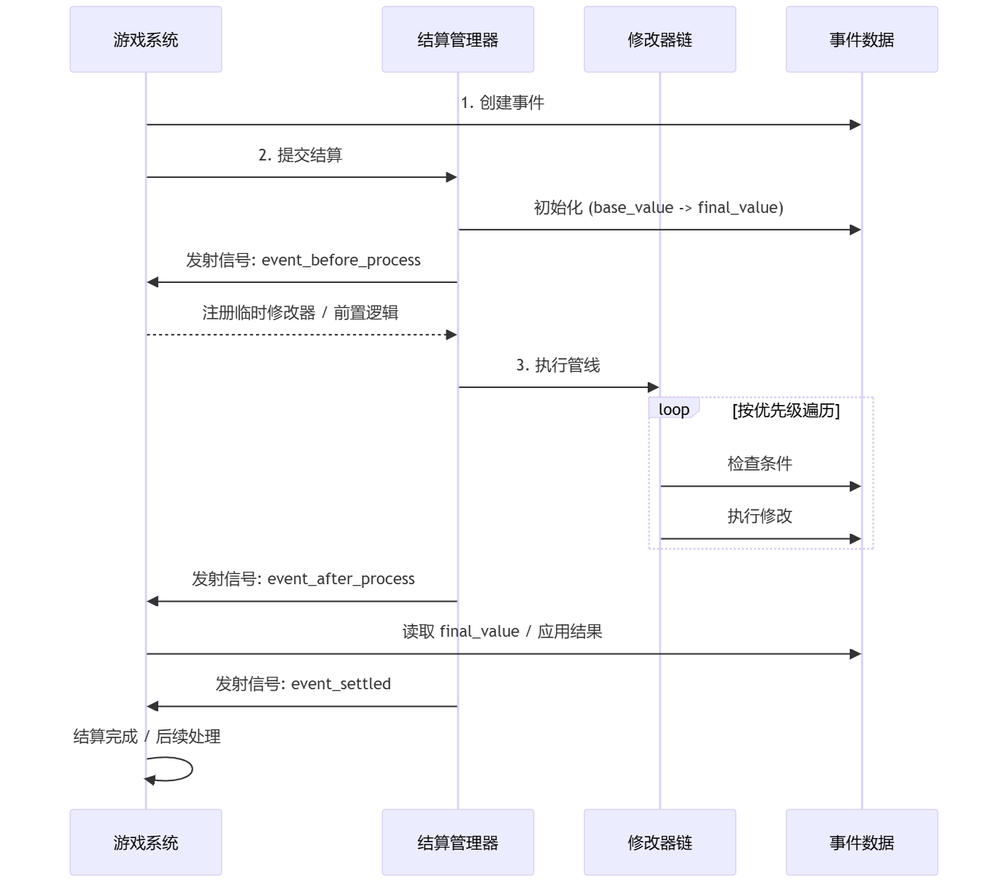

# 事件结算系统 (Event Settlement System)

通用数值管线结算系统 for Godot 4.6+

> English version available at [README.en.md](README.en.md)

---

## 简介

事件结算系统是一套事件驱动的数值管线，专门用于处理游戏内大规模的数值修改场景。它针对“卡牌出牌 → Buff 结算 → 敌人被动 → 结果”这一常见流程进行了抽象，可用于回合制卡牌、RPG 战斗、策略游戏中的所有数值结算需求。

### 为什么需要事件结算系统？

在游戏开发中，我们经常需要处理复杂的数值计算：

```gdscript
# 传统写法：所有逻辑塞在单个函数里
func calculate_damage(attacker, defender, base_damage):
    var damage = base_damage
    damage += attacker.attack_bonus
    damage *= attacker.damage_multiplier
    if randf() < attacker.crit_chance:
        damage *= 2.0
    if defender.has_status("shield"):
        damage = min(damage, defender.shield_cap)
    return max(damage - defender.armor, 0)

# 插件写法：拆成事件 + 修改器
var damage_event = EventUtils.create_damage_event(attacker, defender, base_damage)
var result = EventSettlementManager.process_event(damage_event)
# 具体的 Buff、护盾、被动都写成独立修改器
```

---

## 功能特性

### 核心能力

1. **修改器系统**：支持加法、乘法、覆盖、自定义四种模式，可链式配置，方便组合。
2. **优先级控制**：统一的排序策略，越小越先执行，确保“玩家 Buff → 技能效果 → 敌人被动”这样的顺序准确无误。
3. **多阶段处理**：事件前置 → 处理中 → 后置 → 结算，每个阶段都能插入自定义逻辑与信号。
4. **历史追踪**：在调试构建中自动记录完整的数值变化，便于回溯。

### 进阶特性

- 管线系统：适合需要多阶段分段计算的复杂技能。
- 条件系统：提供常用条件工厂函数，并允许自定义逻辑。
- 阻断机制：通过 `event_data.is_blocked` 实现闪避、免疫等效果。
- WeakRef 引用：事件不会阻止节点被销毁，避免泄漏。
- unique_id：方便 Buff 替换、注销。

---

## 系统示意图




---

## 快速开始

### 安装

1. **下载插件**
   - 从 [Asset Library](https://godotengine.org/asset-library/) 下载
   - 或克隆本仓库到 `addons/event_settlement_system`

2. **启用插件**
   ```
   项目 → 项目设置 → 插件 → 启用"事件结算系统"
   ```

3. **验证安装**
   ```gdscript
   func _ready():
       print(EventSettlementManager)  # 应该输出单例对象
   ```

### 5 分钟上手

```gdscript
extends Node

func _ready():
    # 1. 注册事件类型
    EventSettlementManager.register_event_type("damage")
    
    # 2. 添加修改器
    var crit_modifier = EventModifier.create_multiply_modifier("暴击", 2.0)
    crit_modifier.set_condition(EventUtils.condition_random_chance(0.2))  # 20%暴击
    EventSettlementManager.add_event_modifier("damage", crit_modifier)
    
    # 3. 创建并处理事件
    var damage_event = EventData.new("damage", self, self, 100.0)
    var result = EventSettlementManager.process_event(damage_event)
    
    # 4. 查看结果
    print("最终伤害: ", result.final_value)  # 输出: 100 或 200 (20%概率)
    print(result.get_value_changes())  # 查看详细变化
```

---

## 文档

### 完整文档
详细的使用文档请查看 [docs/使用文档.md](docs/使用文档.md)

### 核心概念速览

#### 1️⃣ EventData（事件数据）
```gdscript
var event = EventData.new("damage", attacker, defender, 100.0)
event.set_extra("damage_type", "fire")  # 添加额外数据
```

#### 2️⃣ EventModifier（修改器）
```gdscript
# 加法修改器：+50伤害
var add_mod = EventModifier.create_add_modifier("伤害加成", 50.0, 100)

# 乘法修改器：1.5倍伤害
var mult_mod = EventModifier.create_multiply_modifier("伤害增强", 1.5, 50)

# 自定义修改器
var custom_mod = EventModifier.create_custom_modifier("复杂逻辑", 
    func(event): event.final_value = calculate_complex_damage(event), 200)
```

#### 3️⃣ EventSettlementManager（管理器）
```gdscript
# 全局修改器（影响所有事件）
EventSettlementManager.add_global_modifier(modifier)

# 特定事件修改器
EventSettlementManager.add_event_modifier("damage", modifier)

# 处理事件
var result = EventSettlementManager.process_event(event)
```

---

## 示例

### 示例 1：卡牌伤害流程

```gdscript
class_name DamageSystem extends Node

func _ready():
    setup_damage_system()

func setup_damage_system():
    # 注册伤害事件
    EventSettlementManager.register_event_type("damage")
    
    # 1. 护甲减伤（优先级 300）
    var armor_mod = EventModifier.create_custom_modifier("护甲", 
        func(event):
            var armor = event.target.armor
            var reduction = armor / (armor + 100.0)
            event.final_value *= (1.0 - reduction),
        1000
    )
    EventSettlementManager.add_event_modifier("damage", armor_mod)
    
    # 2. 暴击系统（优先级 80）
    var crit_mod = EventModifier.create_multiply_modifier("暴击", 2.0, 500)
    crit_mod.set_condition(func(event): 
        return randf() < event.source.crit_rate
    )
    EventSettlementManager.add_event_modifier("damage", crit_mod)
    
    # 3. 属性克制（优先级 120）
    var element_mod = EventModifier.create_custom_modifier("属性克制",
        func(event):
            var dmg_type = event.get_extra("element", "normal")
            var def_type = event.target.element
            if (dmg_type == "fire" and def_type == "grass") or \
               (dmg_type == "water" and def_type == "fire"):
                event.final_value *= 2.0,
        300
    )
    EventSettlementManager.add_event_modifier("damage", element_mod)

func deal_damage(attacker, defender, base_damage: float, element: String = "normal"):
    var event = EventUtils.create_damage_event(attacker, defender, base_damage)
    event.set_extra("element", element)
    
    var result = EventSettlementManager.process_event(event)
    
    defender.take_damage(result.final_value)
    show_damage_popup(defender.global_position, result.final_value)
    
    return result
```

### 示例 2：增益/减益系统

```gdscript
class_name BuffSystem extends Node

var active_buffs: Dictionary = {}

func apply_buff(target: Node, buff_id: String, multiplier: float, duration: float):
    # 创建增益修改器
    var buff = EventModifier.create_multiply_modifier(
        "Buff_%s" % buff_id,
        multiplier,
        100
    )
    
    # 只对特定目标生效
    buff.set_condition(func(event): return event.target == target)
    
    # 添加到系统
    EventSettlementManager.add_global_modifier(buff)
    active_buffs[buff_id] = buff
    
    # 定时移除
    await get_tree().create_timer(duration).timeout
    remove_buff(buff_id)

func remove_buff(buff_id: String):
    if active_buffs.has(buff_id):
        EventSettlementManager.remove_modifier(active_buffs[buff_id])
        active_buffs.erase(buff_id)
```

### 示例 3：技能系统集成

```gdscript
class_name Skill extends Resource

@export var skill_name: String
@export var base_damage: float
@export var skill_type: String = "physical"

func cast(caster: Node, target: Node):
    # 创建技能事件
    var skill_event = EventData.new("skill_damage", caster, target, base_damage)
    skill_event.set_extra("skill_type", skill_type)
    skill_event.set_extra("skill_name", skill_name)
    
    # 技能特定修改器
    if skill_type == "fire":
        var burn_chance = EventModifier.create_custom_modifier("灼烧",
            func(event):
                if randf() < 0.3:  # 30%概率
                    apply_burn_debuff(event.target),
            50
        )
        EventSettlementManager.add_event_modifier("skill_damage", burn_chance)
    
    # 处理技能结算
    var result = EventSettlementManager.process_event(skill_event)
    
    # 应用效果
    apply_skill_effects(result)
    
    return result
```

---

## 项目结构

```
event_settlement_system/
├── addons/
│   └── event_settlement_system/
│       ├── plugin.cfg                      # 插件配置
│       ├── plugin.gd                       # 插件入口
│       ├── core/                           # 核心系统
│       │   ├── event_settlement_manager.gd # 结算管理器（单例）
│       │   ├── event_data.gd              # 事件数据类
│       │   ├── event_modifier.gd          # 修改器基类
│       │   └── settlement_pipeline.gd     # 管线系统
│       └── utils/                         # 工具类
│           └── event_utils.gd             # 辅助函数
├── examples/                              # 示例场景
│   ├── example_usage.tscn                # 示例场景
│   └── example_usage.gd                  # 示例脚本
└── docs/                                 # 文档
    └── 使用文档.md                        # 详细文档
```

---

## 适用场景

- 战斗系统：伤害、治疗、暴击、闪避
- 增益系统：Buff、Debuff、状态效果
- 属性/装备：基础属性与装备加成
- 技能结算：多段技能、合击、触发技
- 经济系统：货币、资源增长、掉落
- 事件驱动系统：黑盒连锁效果

---

## 技术特点

- 纯 GDScript，无外部依赖
- 核心逻辑约 500 行，易读易改
- 调试模式提供断言和完整历史，发布模式只保留必要数据
- Snapshot 遍历防止遍历时修改列表

---

## 系统要求

- Godot Engine 4.6 或更高版本
- 支持桌面、移动端和 Web 发布目标

---

## 贡献

目前暂不接受外部代码贡献，如有建议或问题请通过 Issue 提交反馈。

---

## 许可证

MIT License，见 [LICENSE](LICENSE)。

---

## 致谢

- Godot Engine 社区
- 所有反馈与测试的创作者

---

## 联系方式

- 作者主页：<https://space.bilibili.com/162666214?spm_id_from=333.1007.0.0>

---

<div align="center">

**如果这个插件对你有帮助，请给个 ⭐ Star！**

Made with ❤️ for Godot Community

[⬆ 回到顶部](#-事件结算系统-event-settlement-system)

</div>
